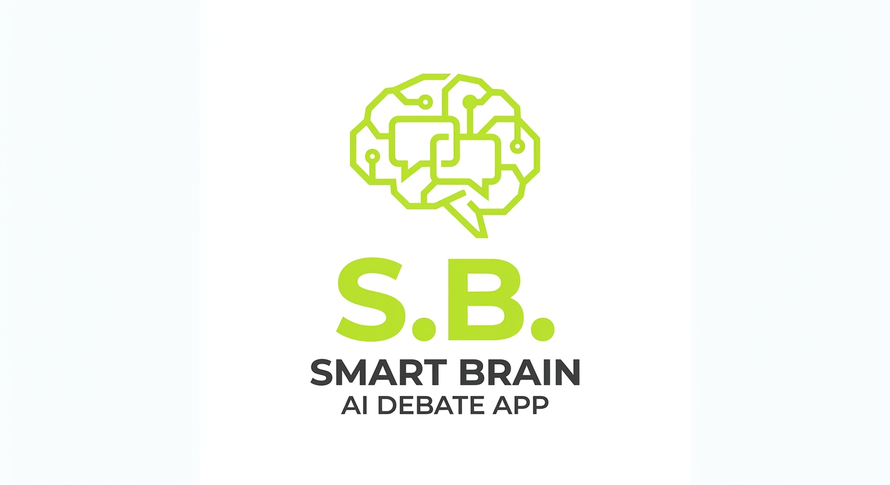
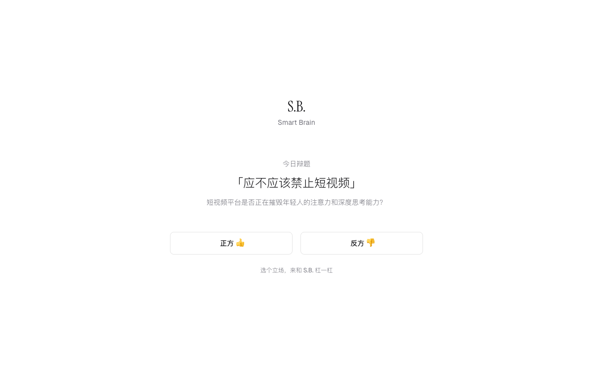
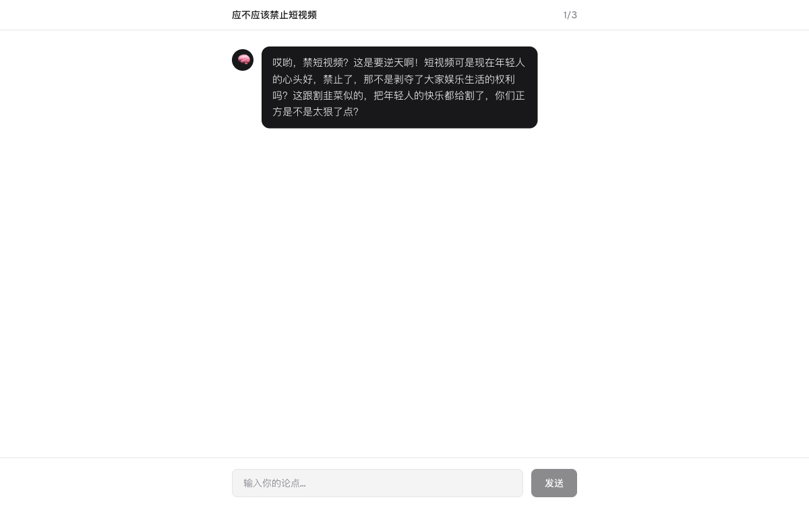
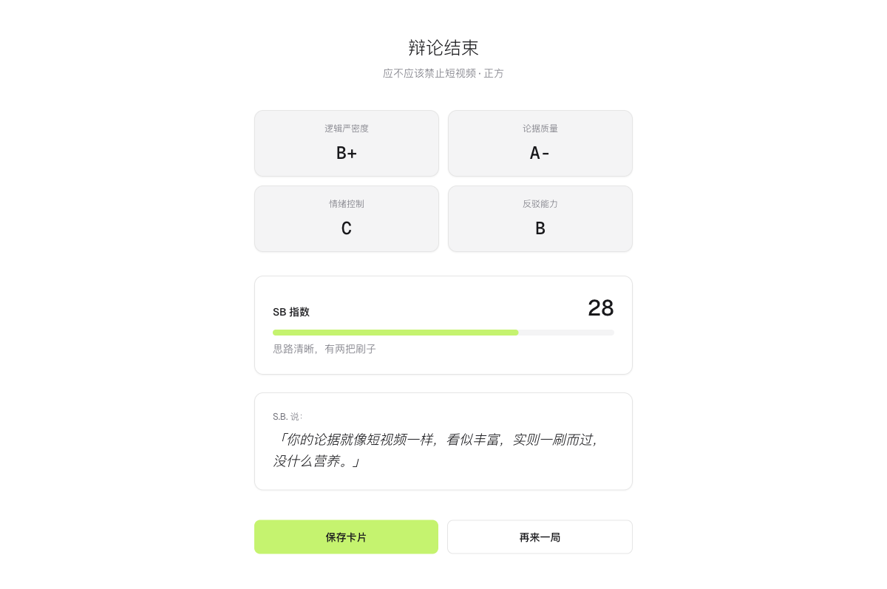

# S.B. Smart Brain



**S.B. 帮你不再 SB** — AI 思维陪练，每日一辩，越吵越聪明。

Live: [sb.rxcloud.group](https://sb.rxcloud.group)

## What is S.B.?

S.B. Smart Brain 是一款 AI 辩论对战应用。每天系统推荐一个争议话题，你选择立场，和一个「街头杠精」风格的 AI 进行 3 轮文字辩论。辩论结束后生成多维度评分报告 + 毒舌点评，可保存为分享卡片。

## Screenshots

| 首页 | 辩论中 | 评分报告 |
|:---:|:---:|:---:|
|  |  |  |

## Features

- **每日一辩** — 系统每天推荐争议话题，选择正方/反方开始辩论
- **3 轮对战** — AI 逐轮升级策略：挑衅 → 拆解 → 致命一击
- **多维评分** — 逻辑力、证据力、感染力、反驳力四维度打分（S ~ D）
- **SB 指数** — 综合评分，配有毒舌点评
- **分享卡片** — 生成精美 OG 图片，一键保存传播
- **匿名使用** — 无需登录，打开即辩

## Tech Stack

| Layer | Technology |
|-------|-----------|
| Frontend | Next.js 16 (App Router) + TailwindCSS v4 |
| AI Model | GLM-4-Flash (ZhipuAI) via OpenAI SDK |
| Database | Supabase (PostgreSQL) |
| Share Card | @vercel/og (Satori) |
| Deployment | Vercel |
| Fonts | Instrument Serif + Geist + Geist Mono |

## Getting Started

```bash
# Install dependencies
npm install

# Set up environment variables
cp .env.local.example .env.local
# Edit .env.local with your keys

# Run development server
npm run dev
```

Open [http://localhost:3000](http://localhost:3000) to start debating.

### Environment Variables

| Variable | Description |
|----------|-------------|
| `GLM_API_KEY` | ZhipuAI API key for GLM-4-Flash |
| `SUPABASE_URL` | Supabase project URL |
| `SUPABASE_ANON_KEY` | Supabase anonymous key |
| `NEXT_PUBLIC_BASE_URL` | Base URL for OG image generation |

## Project Structure

```
src/
├── actions/          # Server actions (debate-reply, generate-score, save-debate, get-topic)
├── app/
│   ├── api/og/       # OG image generation (Edge Runtime)
│   ├── layout.tsx    # Root layout with fonts
│   ├── page.tsx      # Main state machine (home → debate → report)
│   └── globals.css   # TailwindCSS v4 theme tokens
├── components/       # UI components (home-screen, debate-screen, report-screen)
└── lib/              # Shared utilities (types, constants, scoring, prompts, supabase)
```

## Design

- Style: Minimalist white, inspired by framia.pro
- Accent: Lime green `#C5F36F`
- Typography: Instrument Serif (headings) + Geist (body)

## License

MIT
